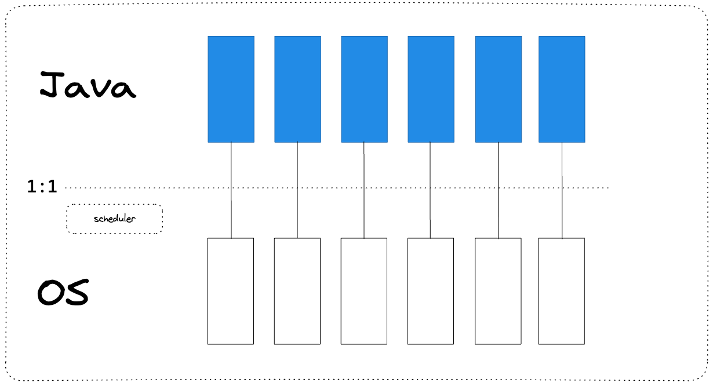
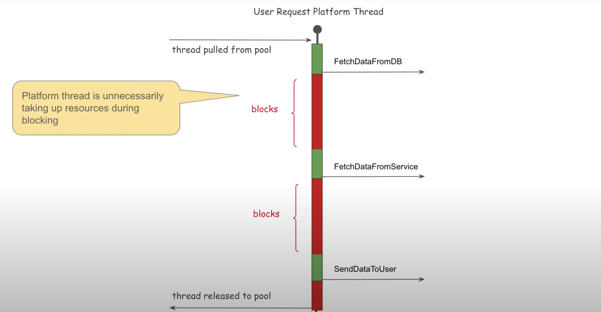
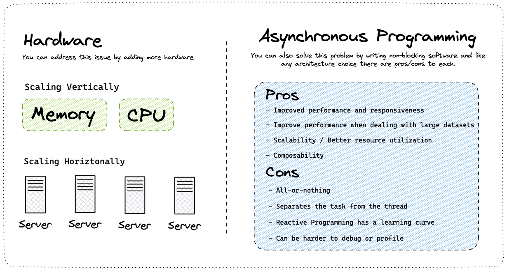
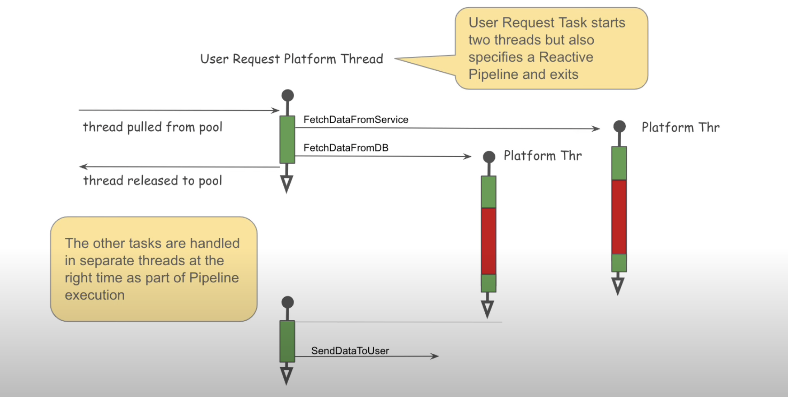
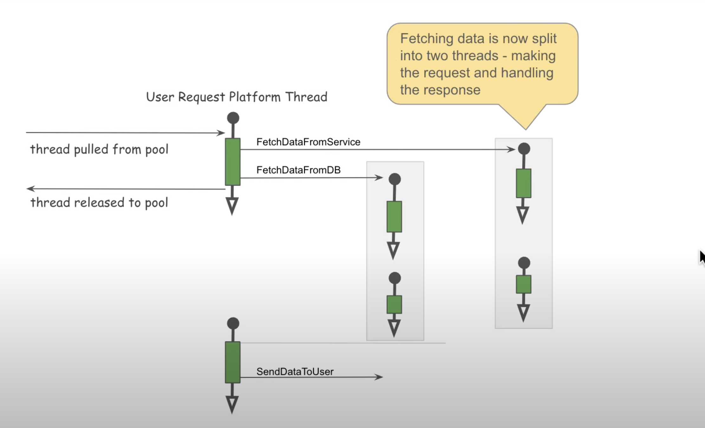
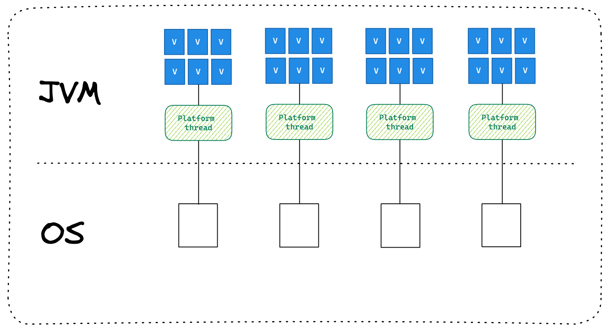
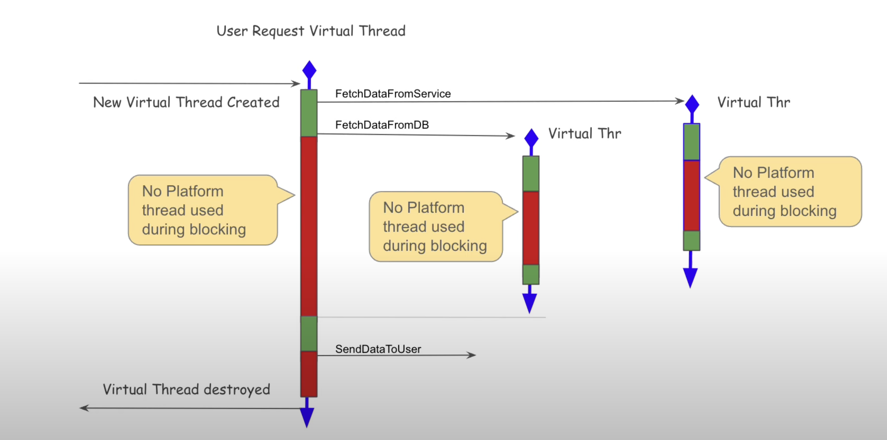

### Java Thread


	•	Egyszerű CPU, 4 mag, Hyper-Threading nélkül: 4 szál.
	•	Modern CPU, 4 mag, Hyper-Threadinggel (2 szál/mag): 8 szál.
	•	Modern CPU, 8 mag, Hyper-Threadinggel (2 szál/mag): 16 szál.

### Blocking Thread


### Scaling horizontally or vertically.


### Async Blocking Design


### Partial Reactive Design

``` 
CompletableFuture.supplyAsync(() -> {
    // Például egy hosszabb művelet, amely egy másik szálon fut
    return hosszúSzámítás();
}).thenApply(result -> {
    // A következő művelet a számítás eredményével
    return feldolgozEredmény(result);
});
``` 
A Servlet 3.0 és 3.1 verziókban az HTTP servlet szálnak nem kell élőnek lennie ahhoz, hogy visszaküldje az HTTP választ a felhasználónak

JAVA 8 bevezette a CompletableFuture osztályt, amellyel reaktív pipeline-okat hozhatunk létre. A reaktív fejlesztési stílus nagy ötlete az, hogy egy pipeline-t specifikálunk egy használati eset végrehajtásához, de magát a használati esetet nem hajtjuk végre közvetlenül. A pipeline végrehajtása függetlenül történik, más szálakon.


A CompletableFuture.supplyAsync() nem használja közvetlenül a Java NIO csomagot. Az aszinkron végrehajtásért felelős, és ha a benne futtatott kód nem blokkoló I/O-t (például Java NIO) használ, akkor az I/O műveletek nem blokkolják a szálat.

### Full Reactive Design


### Virtual Threads


### Virtual Thread



ab -n 20 -c 20 http://localhost:8080/block/2
``` 
server.tomcat.threads.max=1
spring.threads.virtual.enabled=false
``` 

```       
Server Hostname:        localhost
Server Port:            8080

Document Path:          /block/2
Document Length:        39 bytes

Concurrency Level:      20
Time taken for tests:   58.476 seconds
Complete requests:      20
``` 

ab -n 20 -c 20 http://localhost:8080/block/2
``` 
server.tomcat.threads.max=1
spring.threads.virtual.enabled=true
``` 

```       
Server Hostname:        localhost
Server Port:            8080

Document Path:          /block/2
Document Length:        70 bytes

Concurrency Level:      20
Time taken for tests:   7.693 seconds
Complete requests:      20
``` 