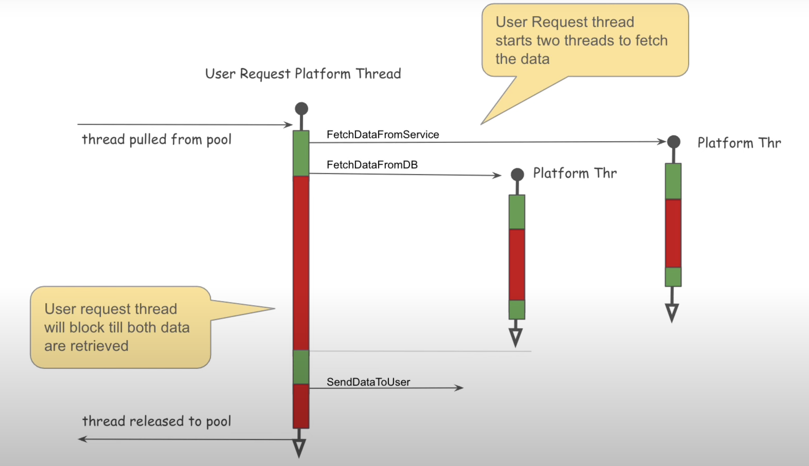

### Java Thread


	•	Egyszerű CPU, 4 mag, Hyper-Threading nélkül: 4 szál.
	•	Modern CPU, 4 mag, Hyper-Threadinggel (2 szál/mag): 8 szál.
	•	Modern CPU, 8 mag, Hyper-Threadinggel (2 szál/mag): 16 szál.

### Blocking Thread


### Scaling horizontally or vertically.


### Async Blocking Design


### Partial Reactive Design


### Full Reactive Design


### Virtual Threads


### Virtual Thread


ab -n 20 -c 20 http://localhost:8080/block/2
``` 
server.tomcat.threads.max=1
spring.threads.virtual.enabled=false
``` 

```       
Server Hostname:        localhost
Server Port:            8080

Document Path:          /block/2
Document Length:        39 bytes

Concurrency Level:      20
Time taken for tests:   58.476 seconds
Complete requests:      20
``` 

ab -n 20 -c 20 http://localhost:8080/block/2
``` 
server.tomcat.threads.max=1
spring.threads.virtual.enabled=true
``` 

```       
Server Hostname:        localhost
Server Port:            8080

Document Path:          /block/2
Document Length:        70 bytes

Concurrency Level:      20
Time taken for tests:   7.693 seconds
Complete requests:      20
``` 